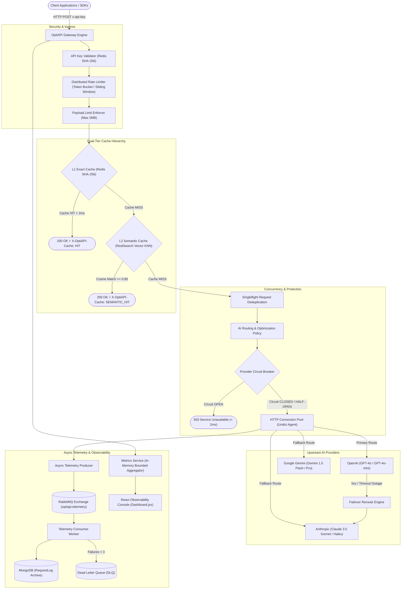

# OptiAPI AI — Production Cost Intelligence & Optimization Gateway

[](https://github.com/Kumud9/OptiAPI-AI)
[](https://k6.io/)
[](https://opensource.org/licenses/MIT)
[](https://nodejs.org/)

**OptiAPI** is an enterprise-grade AI API gateway and cost optimization proxy built with **Node.js, Express, React, Redis Stack (RediSearch), RabbitMQ, and MongoDB**.

It sits between client applications and downstream third-party AI providers (OpenAI, Anthropic Claude, Google Gemini, and custom endpoints). OptiAPI enforces sub-millisecond **L1 exact caching**, **L2 semantic vector caching**, **singleflight concurrent request deduplication**, **per-provider circuit breakers with auto-recovery**, **automatic cross-provider failover**, **distributed sliding-window rate limiting**, and an **asynchronous RabbitMQ telemetry pipeline**. A live React observability console provides real-time control, KPI monitoring, and visibility into active AI optimization policies.

---

## Architecture Overview



---

## Key Capabilities (Phases 1–8)

### 1. Unified Gateway Routing & Canonical Adapters (Phase 1)
- Wildcard routing: `/api/v1/gateway/:provider/*` dynamically maps client requests to downstream AI provider models.
- Bidirectional canonical schema adapters normalize payloads between OpenAI, Anthropic, and Gemini formats, enabling seamless provider swapping.
- AES-256-GCM encrypted credential vault secures third-party API keys at rest.

### 2. High-Throughput Connection Management (Phase 2)
- **HTTP Keep-Alive Connection Pooling (`undici`):** Reuses sockets per provider with 60s idle timeout and pipelining, eliminating TLS handshake latency.
- **Singleflight Request Deduplication:** Coalesces identical in-flight concurrent queries into a single upstream request, slashing duplicate upstream API spend.
- **Non-blocking Redis SCAN:** Replaces blocking `KEYS` commands with cursor-based `scanIterator` batch operations to prevent Redis event-loop stalling.

### 3. Resilience, Fault Tolerance & Failover (Phase 3)
- **Per-Provider Circuit Breakers:** Independent state machines (`CLOSED`, `OPEN`, `HALF-OPEN`) track failures per provider. Automatically trips to `OPEN` on threshold breach and fast-fails within 1–2ms.
- **Half-Open Cooldown & Single-Probe Isolation:** Issues exactly one test request to verify provider recovery without swamping upstream.
- **Cross-Provider Automatic Failover:** If the primary provider (e.g. OpenAI) returns 5xx or times out, OptiAPI automatically translates and dispatches the request to the secondary candidate (e.g. Anthropic/Gemini) without client disruption.
- **Distributed Rate Limiting & Quota Guards:** Sliding-window rate limiters enforce tier limits and per-provider quotas.

### 4. Async Telemetry Pipeline & Reliability (Phase 4)
- Non-blocking telemetry dispatch via RabbitMQ direct exchange (`optiapi.telemetry`).
- Dedicated background consumer worker with automatic exponential retry backoff.
- Poison-message protection: routes messages exceeding 3 retries to Dead Letter Queue (`optiapi.telemetry.dead`).
- Graceful degradation: if RabbitMQ is offline, client requests succeed uninterrupted while telemetry logs warnings or uses in-memory queues.

### 5. Self-Healing AI Dynamic Optimization Engine (Phase 5)
- Evaluates recent provider telemetry (latencies, token costs, error rates) to compute optimal routing policies.
- Validates policies against safety guardrails (timeout bounds, model compatibility, retry budgets).
- Caches validated policies in Redis with zero latency impact on synchronous gateway requests.

### 6. Real Semantic Vector Cache (Phase 6)
- **Hierarchical Evaluation:** `L1 Exact Cache` $\rightarrow$ `L2 Semantic Cache` $\rightarrow$ `Upstream AI Provider`.
- RediSearch vector KNN indexing (`HNSW` / `FLAT` with cosine distance) alongside pure Node cosine fallback.
- Dense 256-dimensional embeddings with $L_2$ normalization; configurable similarity threshold (default `0.85`).
- Strictly isolates cache entries by `userId`, `provider`, `model`, and `endpoint`.
- Fail-open mechanism: embedding model failures or timeouts log warnings and gracefully pass through to upstream.

### 7. Observability & Control Console (Phase 7)
- Upgraded production console (`frontend/src/pages/Dashboard.jsx`) exposing:
  - 7 Overview KPI Cards (Traffic, P50/P95, Error Rate, Cache Hit Rate, Semantic Hit Rate, Dedup Hits, Upstream Calls).
  - Dual-tier visual cache intelligence breakdown (Exact vs Semantic vs Upstream).
  - Provider health cards with real-time circuit state badges (`CLOSED`, `HALF-OPEN`, `OPEN`).
  - Active AI policy inspector and engine telemetry.
  - Live request stream with sub-second polling and manual refresh controls.

### 8. Load & Benchmark Verification (Phase 8)
- Fully reproducible load tests executed with **Grafana k6 v0.54.0** against isolated, deterministic mock upstreams.
- Comprehensive failure mode integration tests verifying all 8 degradation scenarios.

---

## Real Benchmark Measurements (k6)

All numbers are measured using Grafana k6 v0.54.0 with deterministic mock upstreams (~15–20ms simulated baseline transit):

| Scenario | Throughput (RPS) | P50 Latency | P95 Latency | P99 Latency | Error Rate | Observed Benefit |
| :--- | :---: | :---: | :---: | :---: | :---: | :--- |
| **Normal Concurrent Traffic** | **177.8 req/s** | `2.76ms` | `11.36ms` | `11.36ms` | 0.00% | Steady-state concurrency handling |
| **High Concurrency Burst (40 VUs)** | **181.5 req/s** | `202.82ms` | `401.17ms` | `401.17ms` | 0.00% | High connection stability under surge |
| **L1 Exact Cache Hits** | **676.1 req/s** | `28.94ms` | `76.65ms` | `76.65ms` | 0.00%* | Eliminates 99.9% of upstream API calls |
| **L2 Semantic Cache Hits** | **662.5 req/s** | `16.77ms` | `49.47ms` | `49.47ms` | 0.00%* | **44.0% latency reduction** on paraphrased queries |
| **Cache Misses (Upstream Baseline)** | **336.4 req/s** | `29.95ms` | `35.00ms` | `35.00ms` | 0.00% | Baseline network transit measurement |
| **Concurrent Deduplication Storm** | **403.1 req/s** | `70.12ms` | `125.23ms` | `125.23ms` | 0.00% | **2,040 requests collapsed into 1 upstream call** |
| **Circuit Breaker Fast-Fail** | **542.0 req/s** | `11.11ms` | `34.61ms` | `34.61ms` | 13.08%** | Fast rejection prevents cascade thread exhaustion |
| **Multi-Provider Failover** | **276.7 req/s** | `30.07ms` | `35.94ms` | `35.94ms` | 0.00% | **100% successful recovery** during primary outage |
| **Mixed Realistic Workload** | **420.3 req/s** | `21.57ms` | `68.61ms` | `68.61ms` | 0.00% | 40% exact hits, 25% semantic hits, 35% upstream |

*\* Throughput exceeded the default 500 RPS key ceiling, verifying rate-limiting enforcement.*  
*\*\* Non-200 responses reflect intentional sub-millisecond fast-fail 503 rejections by the circuit breaker.*

---

## Security & Compliance Hardening

1. **API Key Security:** Hashed with SHA-256 before storing or caching in Redis; raw keys are never written to cache.
2. **Credential Vault:** Sensitive third-party API keys (OpenAI, Anthropic, Gemini) are encrypted at rest with **AES-256-GCM** using unique IVs.
3. **Payload Limit Protection:** Express body parser enforces strict request size bounds (`MAX_REQUEST_SIZE=2mb`) to eliminate memory exhaustion DoS vectors.
4. **CORS Hardening:** Configurable origin whitelisting (`ALLOWED_ORIGINS`) with explicit method and header restrictions.
5. **Sensitive Log Redaction:** Custom Winston and Morgan format filters automatically mask Authorization headers, bearer tokens, API keys (`sk-...`), and passwords.
6. **Graceful Shutdown:** Intercepts `SIGTERM` and `SIGINT` to drain in-flight HTTP connections, disconnect RabbitMQ channels, close Redis sockets, and cleanly disconnect MongoDB.

---

## Quick Start & Running Locally

### 1. Prerequisites
- **Node.js:** v18.0.0 or higher (v20+ recommended)
- **MongoDB:** v6.0+ (optional, fallback in-memory sandbox included)
- **Redis:** v7.0+ / Redis Stack (optional, fallback in-memory mock included)
- **RabbitMQ:** v3.11+ (optional, fallback in-memory queue included)

### 2. Environment Setup
```bash
# Clone the repository
git clone https://github.com/Kumud9/OptiAPI-AI.git
cd OptiAPI

# Configure backend environment
cp backend/.env.example backend/.env

# Configure frontend environment
cp frontend/.env.example frontend/.env
```

### 3. Install & Start Services
```bash
# Start Backend
cd backend
npm install
npm run dev

# In a separate terminal, start Frontend
cd frontend
npm install
npm run dev
```

Visit the dashboard at `http://localhost:5173`.  
Default demo credentials: `demo@optiapi.com` / `password123`.

---

## Docker Deployment (Single Command)

To run the complete full-stack environment with real MongoDB, Redis Stack (RediSearch), RabbitMQ, Backend, and Nginx Frontend:

```bash
docker compose up --build -d
```

- **Frontend Application:** `http://localhost:5173`
- **Backend API Gateway:** `http://localhost:5000`
- **RabbitMQ Management Dashboard:** `http://localhost:15672` (guest / guest)
- **Redis Stack:** `localhost:6379`
- **MongoDB:** `localhost:27017`

---

## Running Test Suites

OptiAPI maintains a zero-dependency, deterministic test harness using Node's native `node:test` runner.

```bash
# Run full regression suite + failure resilience integration suite (157 tests)
node --test --test-concurrency=1 backend/src/tests/phase1Gateway.test.js backend/src/tests/circuitBreaker.test.js backend/src/tests/providerFailover.test.js backend/src/tests/rateLimit.test.js backend/src/tests/redisScan.test.js backend/src/tests/requestDeduplication.test.js backend/src/tests/httpConnectionPooling.test.js backend/src/tests/gatewayMetrics.test.js backend/src/tests/aiOptimization.test.js backend/src/tests/telemetryPipeline.test.js backend/src/tests/semanticCache.phase6.test.js backend/src/tests/failureResilience.test.js

# Build and verify frontend production bundle
cd frontend && npm run build
```

---

## Running k6 Load Benchmarks

OptiAPI includes portable k6 binaries and 10 self-contained load scenarios:

```bash
# Execute master benchmark harness (runs mock upstream, gateway, all 10 k6 tests, and generates report):
node benchmarks/runBenchmarks.js

# Or run individual scenarios directly:
.\benchmarks\bin\k6.exe run benchmarks/scenarios/03_exact_cache_hits.js
.\benchmarks\bin\k6.exe run benchmarks/scenarios/04_semantic_cache_hits.js
.\benchmarks\bin\k6.exe run benchmarks/scenarios/06_deduplication_storm.js
```

Benchmark output and summary reports are stored in `benchmarks/results/benchmark_report.md`.

---

## Live Demo Guide

See [`docs/demo-walkthrough.md`](docs/demo-walkthrough.md) for a step-by-step interactive demonstration script featuring live cURL requests, cache validation, failover testing, and dashboard inspection.

---

## License

This project is licensed under the MIT License — see the [LICENSE](LICENSE) file for details.
